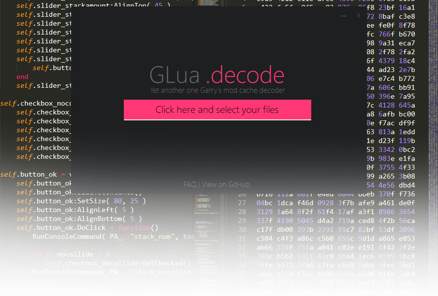

# GLuaDecode

GLuaDecode is a simple C # app to decode, encode, obfuscate Garry's mod .lua files. 

### Features:
- Decode LZMA compressed .lua files
- Encode (read as: compress) .lua files with LZMA
- Simple obfuscator

## FAQ:
### What does decode and encode do?
GLuaDecode able to decode LZMA compressed Garry's mod .lua cache.
Btw, it able to encode it too.

### What obfuscator does?
Transform your original .lua translate your code.
The result of the original code will be the exact functionality of the original code.

### How does it works?
Obfuscation is a ton of original code transformation: functions, arguments, vars renaming, string hexadecimal, etc.
It will become somthing unreadable.

### What it can exact?
1. Remove line breaks from code
2. Generate random identifier names using hexadecimal pattern
3. Dead Code injection
4. Escape Unicode Sequence
5. Transform Object Keys
6. Reversed Names, vars
